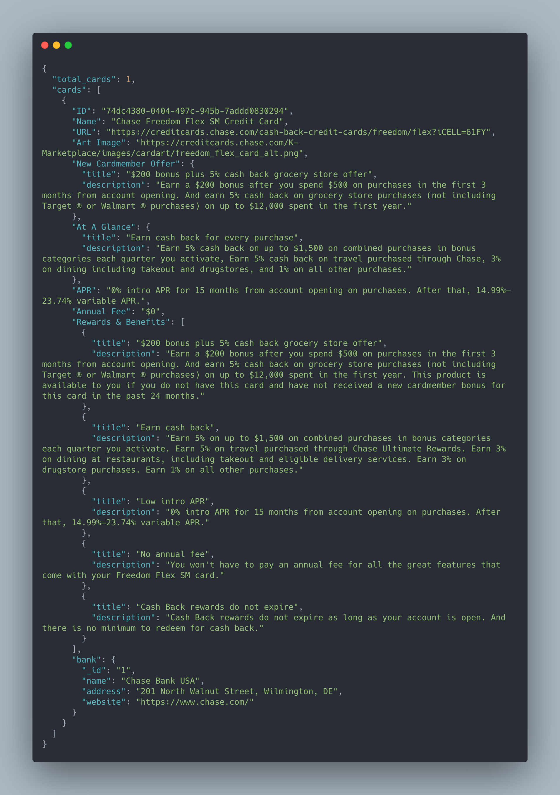
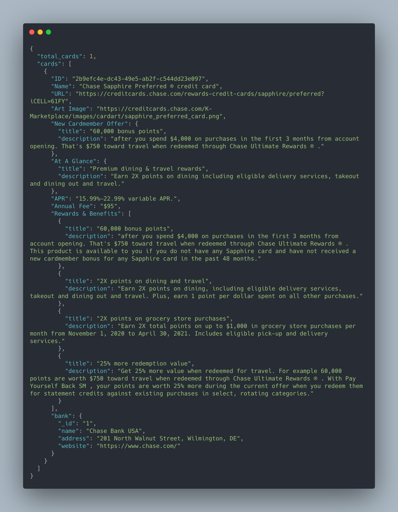
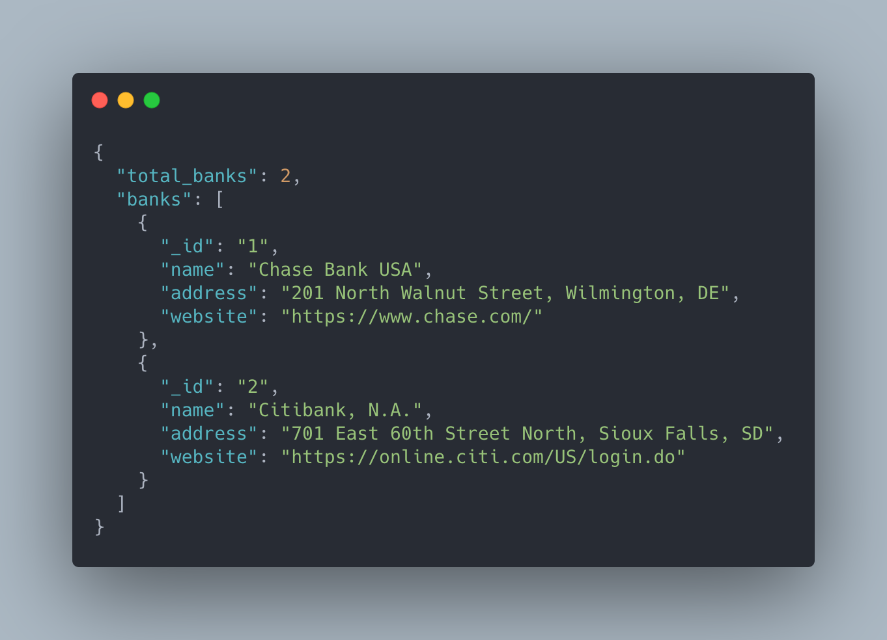

## Project Name
###Credit Card & Bank Web API###

## Description
A free, server-side web API supplying credit card and bank data.

## Usage
After signing up, you'll be given your own, unique API key which you can access in the Dashboard section. This 165 character string is your API key. The key:

* Uniquely identifies you.
* Gives you access to all routes available in CCdeck API's service.
* Should be kept private and should not be shared.
To use your key, simply pass the key as a URL query parameter when making Web service requests. For example:

Send all **card** requests to:
```
GET   https://ccdeck-api.herokuapp.com/cards?&api_key=YOUR_KEY_HERE
```

Send all **bank** requests to:
```
GET    https://ccdeck-api.herokuapp.com/banks?&api_key=YOUR_KEY_HERE
```

## GET Query Parameters

| Parameter | Routes | Required | Default Value | Description |
|---|---|---|---|---|
|```api_key```|```/cards?``` ```/banks?```|Yes|empty|A valid API key to access and use the routes available on this API.
|```id```|```/cards?```|Optional|empty|A valid card ID. Only include card that has this ID.
|```name```|```/cards?```|Optional|empty|Character or set of characters part of card name to search for. Only include cards that have this character or set of characters in their name (case-insensitive).
|```bank_id```|```/cards?```|Optional|empty|A comma separated list of bank IDs. Only include cards that have one of these bank IDs. To get a list of all bank IDs, please use ```https://ccdeck-api.herokuapp.com/banks```.


## Examples
```
GET    https://ccdeck-api.herokuapp.com/cards?&api_key=YOUR_KEY_HERE&name=freedom
```
  

```
GET    https://ccdeck-api.herokuapp.com/cards?&api_key=YOUR_KEY_HERE&id=2b9efc4e-dc43-49e5-ab2f-c544dd23e097
```
  

```
GET    https://ccdeck-api.herokuapp.com/banks?&api_key=YOUR_KEY_HERE
```
  

## URL
[https://ccdeck-api.herokuapp.com](https://ccdeck-api.herokuapp.com)

## Tech
* Python / Beautiful Soup (scraper)
* JavaScript
* Node.js / Express.js
* PostgreSQL
* HTML/CSS
* Bootstrap 

## Contact
email:  juan.guzman.sd@gmail.com
